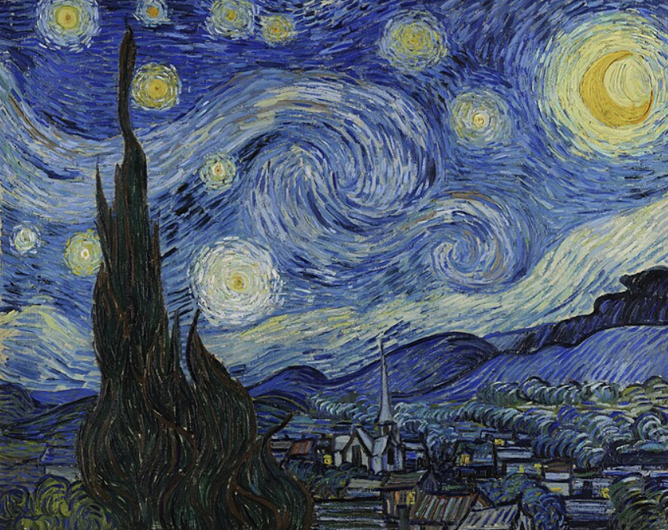

# Local Search Algorithms

<div style="display: flex; justify-content: space-between; margin-bottom: 20px;">
    
    
    
</div>

## Project Overview

This project implements and visualizes three local search algorithms to find optimal points on a 3D surface generated from an image. The algorithms navigate the state space seeking states with higher values (higher brightness in the image).

## Algorithms Implemented

1. **Random Restart Hill Climbing**: Performs multiple hill climbing searches from random starting points and returns the best path found.
2. **Simulated Annealing**: Uses a temperature schedule to control the probability of accepting worse states during the search.
3. **Local Beam Search**: Maintains multiple states simultaneously and expands the most promising ones.

## Project Structure

- `monalisa.jpg`: Source image used to generate the state space.
- `problem.py`: Contains the `Problem` class that defines the state space and provides visualization methods.
- `search.py`: Implements the `LocalSearchStrategy` class with all three search algorithms.
- `test.py`: Provides a test harness to run and compare the algorithms.
- `viz3d.py`: Helper script with examples for visualizing the state space.

## Requirements

- Python 3.7+
- NumPy
- Matplotlib
- OpenCV (cv2)

## Installation

1. Ensure Python 3.7 or higher is installed on your system.
2. Install the required packages:
   ```bash
   pip install numpy matplotlib opencv-python
   ```

## Usage

The improved test script provides a comprehensive command-line interface:

```bash
python test.py --algorithms rrhc sa lbs --num-trials 15 --save-visualizations
```

### Command-line Options

```
usage: test.py [-h] [--image IMAGE] [--algorithms {all,rrhc,sa,lbs} [{all,rrhc,sa,lbs} ...]]
               [--num-trials NUM_TRIALS] [--k K] [--initial-temp INITIAL_TEMP]
               [--cooling-rate COOLING_RATE] [--save-visualizations] [--output-dir OUTPUT_DIR]
               [--show-state-space] [--save-results] [--log-level {DEBUG,INFO,WARNING,ERROR,CRITICAL}]
               [--log-file LOG_FILE] [--no-console-log]
```

#### Algorithm Selection
- `--algorithms`: Algorithms to run (`rrhc`, `sa`, `lbs`, or `all`)

#### Algorithm Parameters
- `--num-trials`: Number of trials for Random Restart Hill Climbing
- `--k`: Number of states for Local Beam Search
- `--initial-temp`: Initial temperature for Simulated Annealing
- `--cooling-rate`: Cooling rate for Simulated Annealing

#### Output and Visualization
- `--save-visualizations`: Save visualizations instead of displaying them
- `--output-dir`: Directory to save visualizations and results
- `--show-state-space`: Show the state space visualization
- `--save-results`: Save results to JSON file

#### Logging Options
- `--log-level`: Set the logging level (DEBUG, INFO, WARNING, ERROR, CRITICAL)
- `--log-file`: Path to log file
- `--no-console-log`: Disable logging to console

## Visualization Examples

### State Space


### Algorithm Paths


## Implementation Details

### Problem Formulation
Each state in the state space is represented by:
- `x`: X-coordinate in the image
- `y`: Y-coordinate in the image
- `z`: Pixel brightness at (x,y), representing the value to be maximized

### Random Restart Hill Climbing
This algorithm:
- Starts with a random state
- Repeatedly moves to the best neighboring state until reaching a local maximum
- Restarts from a new random state and keeps track of the best solution found

### Simulated Annealing
This algorithm:
- Starts with a random state and high temperature
- Considers random neighboring states
- Always accepts better states
- Probabilistically accepts worse states based on the current temperature
- Gradually decreases temperature according to the schedule

### Local Beam Search
This algorithm:
- Starts with k random states
- Generates all neighbors of all current states
- Selects the k best states from all generated neighbors
- Returns the path to the best state found

## Results Analysis

When you run the test script, a comparison table is displayed showing:
- Final state value (z) reached by each algorithm
- Path length (number of steps taken)
- Execution time

Example output:
```
=== Algorithm Comparison ===
Algorithm                    | Final Value  | Path Length  | Time (s)  
----------------------------------------------------------------------
Random Restart Hill-Climbing | 247.00       | 12           | 0.85      
Simulated Annealing          | 232.00       | 43           | 1.32      
Local Beam Search            | 255.00       | 8            | 2.14      
```

## Logging System

The project includes a comprehensive logging system that:
- Records detailed information about each algorithm run
- Maintains a searchable history of all executions
- Captures performance metrics and error conditions
- Supports multiple output destinations (console, file)

## License

This project is available under the MIT License.

## References

- Russell, S. J., & Norvig, P. (2020). Artificial Intelligence: A Modern Approach (4th ed.). Pearson.